<p align="center">
  
</p>

<h1 align="center">Hundir la Flota — Edición Pirata</h1>

---

## 📋 Descripción

Primer proyecto de programación del Bootcamp de Data Science en The Bridge. Una recreación del clásico juego de mesa Hundir la Flota desarrollada en Python, con temática pirata y una versión Android empaquetada con Capacitor.

El objetivo del proyecto era aplicar los fundamentos aprendidos al inicio del bootcamp: condicionales, bucles, Programación Orientada a Objetos y organización del código en módulos.

---

## 🗂️ Estructura del proyecto

```
hundir_la_flota/
│
├── hundirlaflota.py   # Archivo principal — bucle del juego
├── clases.py          # Clase Barco (eslora, coordenadas, vidas, nombre)
├── utils.py           # Funciones: tableros, colores, disparos, colocación
│
├── hundir-pirata/     # App Android empaquetada con Capacitor
├── prueba/            # Versión mini para banco de pruebas
└── img/               # Imágenes del repositorio
```

---

## ⚙️ Flujo del juego

1. Se crean los tableros del jugador y del rival (uno oculto, uno visible)
2. Se coloca la flota de cada jugador aleatoriamente
3. Se ejecuta el bucle principal: turno del jugador → turno de la máquina
4. El juego termina cuando una flota queda completamente hundida

---

## 🛠️ Tecnologías


---

## 👤 Autor

**Roberto Cantero** — proyecto de iniciación a Python y POO
